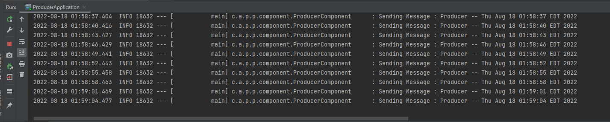
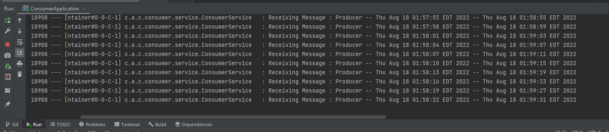
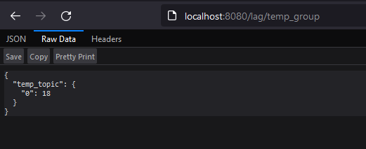
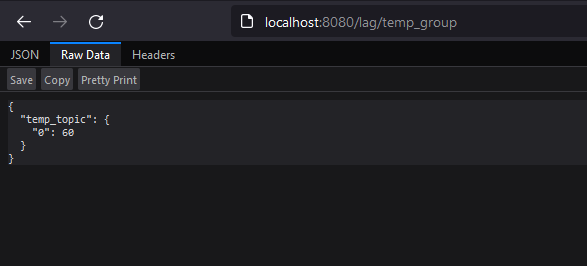

# Kafka Consumer Lag calculation

Consumer lag is one of the most important metrics for estimating the load in event driven systems. This POC generates a lag between producer and consumer, another API calculates the generated lag.

# How to run
<ol>
<li>
Install docker and setup kafka using the kafka_setup.yml docker compose file.

```bash
docker-compose -f .\kafka_setup.yml up -d
```

</li>

<li>

Get into the kafka container as root.

```bash
docker exec -it kafka bash
```

</li>

<li>
Get into the corresponding kafka folder.

```bash
cd opt/kafka_2.13-2.8.1/bin
```

</li>

<li>
Create a topic of any name.

```bash
kafka-topics.sh --create --zookeeper zookeeper:2181 --replication-factor 1 --partitions 1 --topic <topic_name>
```
</li>

<li>
Start producer from the main file. Please edit the application.properties file as per your requirements.
</li>
<li>
Start consumer from the main file. Please edit the application.properties file as per your requirements.
It is preferred that consumer wait time should be more than producer wait time.
</li>
<li>
Start lag analyzer service.
</li>
<li>
Goto the below url where 'temp_group' is the "group_name" of your choice. (Should match with consumer properties) 

```bash
http://localhost:8080/lag/temp_group
```

</li>

</ol>

# Output

<ol>

<li>
Producer Output


</li>

<li>
Consumer Output


</li>

<li>
Lag initial stages


</li>

<li>
Lag increasing in later stages


</li>
</ol>


# Additional comments
```bash
docker-compose -f .\kafka_setup.yml up -d

cd opt/kafka_2.13-2.8.1/bin

kafka-topics.sh --create --zookeeper zookeeper:2181 --replication-factor 1 --partitions 1 --topic temp_topic

kafka-topics.sh --list --zookeeper zookeeper:2181

kafka-consumer-groups.sh --bootstrap-server kafka:9092 --describe --group temp_group

kafka-console-producer.sh --broker-list kafka:9092 --topic temp_topic

kafka-console-consumer.sh --bootstrap-server kafka:9092 --topic temp_topic --from-beginning --group temp_group
```